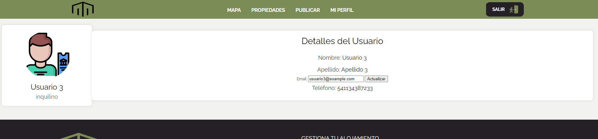

# Sistema para una Inmobiliaria

## Propuesta

Este sistema está diseñado para gestionar propiedades inmobiliarias con diferentes roles de usuario y funcionalidades específicas para mejorar la experiencia tanto de los inquilinos como de los propietarios y empleados.

## Funcionalidades

### 1. Gestión de Propiedades

- **Registro de Propiedades:** Permite registrar y almacenar detalles de propiedades como ubicación, tamaño, características, imágenes, precio, etc.
- **Categorías:** Las propiedades se pueden categorizar por tipo (casa, apartamento, etc.) y ubicación.
- **Búsqueda Avanzada:** Los clientes pueden buscar propiedades según criterios específicos como precio, ubicación, tipo, etc.
- **Etiquetado:** Las propiedades disponibles pueden ser etiquetadas para facilitar su identificación.

### 2. Gestión de Publicaciones

- **Roles de Usuario:**
  - **Inquilino:** Puede ver propiedades y solicitar reservas. Recibe notificaciones por correo electrónico sobre la solicitud de reserva, y tanto el inquilino como el propietario de la publicación son notificados mediante la API de correo de Google.
  - **Propietario:** Puede publicar propiedades y solicitar reservas en publicaciones de otros propietarios. También recibe notificaciones por correo electrónico sobre las solicitudes de reserva.
  - **Empleado:** Gestiona las propiedades que el propietario solicita dar de alta. La comunicación entre el propietario y el empleado se realiza por correo electrónico, y ambos usuarios son notificados cuando cambia el estado de una publicación.

## Usuarios por Defecto

Hay tres usuarios predeterminados para pruebas, cada uno con un rol diferente. Para probar la comunicación por correo y el restablecimiento de contraseñas, es necesario actualizar los correos electrónicos de cada tipo de usuario con direcciones individuales válidas. Se requieren al menos dos correos distintos para los perfiles de propietario y empleado.

### Detalles de Usuarios por Defecto

1. **Usuario Inquilino**
   - **Email:** `usuario1@example.com`
   - **Contraseña:** `password1`
   - **Tipo de Usuario ID:** 1

2. **Usuario Empleado**
   - **Email:** `usuario2@example.com`
   - **Contraseña:** `password2`
   - **Tipo de Usuario ID:** 2

3. **Usuario Propietario**
   - **Email:** `usuario3@example.com`
   - **Contraseña:** `password3`
   - **Tipo de Usuario ID:** 3

> **Nota:** `tipo_usuario_id` corresponde a:
> - 1 = Inquilino
> - 2 = Empleado
> - 3 = Propietario

Para poder hacer las pruebas de reseteo y comunicación entre tipos de usuario, se debe actualizar el correo electrónico. Esto se puede realizar yendo al perfil del usuario y actualizándolo por uno válido, como se indica en la siguiente imagen.

### 4. Vistas

- **Publicaciones:** Vista general de todas las publicaciones.
- **Mis Publicaciones:** Vista específica para propietarios que muestra sus propias publicaciones.
- **Gestionar Reservas:** Vista para manejar las reservas solicitadas por otros propietarios o inquilinos.
- **Gestionar Propiedades:** Vista para empleados para cambiar el estado de aceptación de una publicación.
- **Reseteo de Contraseña:** Permite probar la funcionalidad de reseteo de contraseña. Asegúrate de haber ingresado una contraseña válida en el seeder.
- **Mapa:** Permite ingresar una dirección y ver las propiedades activas en el mapa.

## Técnicas de SEO

- **GEOIp:** Implementación para mejorar la localización geográfica de las propiedades mediante la api de [Nominatim](https://nominatim.org/release-docs/develop/api/Search/) de los usuarios.

## Mapa del Sitio

1. Inicio
2. Mapa
3. Propiedades
4. Publicar
5. Mis Propiedades
6. Mis Reservas
7. Mi Perfil
